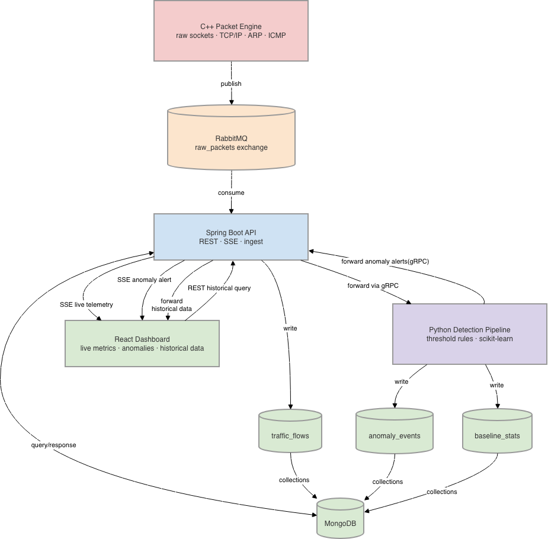

# Network Telemetry Engine

A real-time network packet capture and anomaly detection system built across
four services: a C++ capture engine, a Spring Boot API, a Python detection
pipeline, and a React dashboard — connected by RabbitMQ and MongoDB.

---

## System Architecture



### Data Flows

| Flow | Transport | Description |
|---|---|---|
| C++ → RabbitMQ | AMQP, JSON | One enriched frame per message, topic exchange |
| RabbitMQ → Spring Boot | AMQP, `@RabbitListener` | Spring consumes `raw_packets.spring` queue |
| Spring Boot → MongoDB | MongoDB driver | Writes `traffic_flows` — one document per frame |
| Spring Boot → React | SSE | Live telemetry stream + anomaly alerts + Historical data |
| Spring Boot → Python | gRPC / protobuf | `PacketBatch` messages, batched for efficiency |
| Python → Spring Boot | gRPC / protobuf | `AnomalyEvent` with rule name + evidence |
| Python → MongoDB | MongoDB driver | Writes `anomaly_events` + `baseline_stats` directly |
| React → Spring Boot | REST (HTTP) | Historical queries — packets, anomalies |

---

## Getting Started

See [docs/setup.md](docs/setup.md) for full setup instructions.

### Prerequisites

| Tool | Min version | Purpose |
|---|---|---|
| Docker | 24.0 | Container runtime |
| Docker Compose | 2.20 | Multi-service orchestration |
| CMake | 3.25 | C++ build system (local dev only) |
| Ninja | 1.11 | C++ build backend (local dev only) |

### Quick Start

```bash
# 1. Copy env template to project root
cp scripts/.env.example .env

# 2. Start RabbitMQ + MongoDB
docker compose up rabbitmq mongodb

# 3. Confirm RabbitMQ management UI
# http://localhost:15672  (guest / guest)

# 4. Start all services
docker compose up
```

### CMake Presets (C++ local development)

```bash
cd cpp-packet-engine

# dev — Debug, Ninja, exports compile_commands.json for clangd
cmake --preset dev
cmake --build build/dev
ctest --test-dir build/dev --output-on-failure

# docker — Release, used inside container
cmake --preset docker

# ci — Release + compile_commands.json, used in GitHub Actions
cmake --preset ci
```

### Useful Scripts

```bash
# Reset MongoDB collections + RabbitMQ queues between test runs
./scripts/reset.sh

# Watch live SSE stream 
./scripts/sse_tail.sh

# Simulate attacks for rule testing 
python scripts/simulate_attack.py
```

---

## MongoDB Collections

| Collection | Written by | Contents |
|---|---|---|
| `traffic_flows` | Spring Boot | One document per captured frame — all 30 fields |
| `anomaly_events` | Python pipeline | Rule name, src/dst IP, evidence, timestamp, source (threshold or isolation_forest)|
| `baseline_stats` | Python pipeline | Flow key, mean, std dev, percentile buckets, window_start, source (cicids2017 or live_traffic) |

All collections have TTL indexes on `timestamp`. Schema defined in
`infra/mongo/init-collections.js`.

---

## 15 Detection Rules

| # | Rule | Protocol | Key fields used |
|---|---|---|---|
| 1 | High packet rate per flow | TCP/UDP | `packet_size`, `timestamp`, `flow_key` |
| 2 | Large packet size anomaly | TCP/UDP | `packet_size`, `flow_key` |
| 3 | Oversized ICMP — ping of death | ICMP | `packet_size` > 1500 |
| 4 | ARP spoofing — MAC/IP mismatch | ARP | `arp_sender_ip`, `arp_sender_mac` |
| 5 | SYN without ACK | TCP | `flags` bitmask |
| 6 | NULL scan — no flags set | TCP | `flags` = 0 |
| 7 | XMAS scan — FIN+PSH+URG | TCP | `flags` = 0x29 |
| 8 | SYN flood | TCP | `syn_count`, `timestamp`, `flow_key` |
| 9 | Unexpected RST flood | TCP | `rst_count`, `flow_key` |
| 10 | Incomplete TCP handshake | TCP | `syn_count`, `syn_ack_count` |
| 11 | Port scan — many dst ports same src | TCP/UDP | `src_ip`, `dst_port`, `flow_key` |
| 12 | DNS tunneling — oversized UDP port 53 | UDP | `dst_port` = 53, `packet_size` |
| 13 | TCP retransmission storm | TCP | `seq_num`, `is_retransmit` |
| 14 | TTL anomaly | TCP/UDP/ICMP | `ttl` |
| 15 | Asymmetric traffic ratio | TCP/UDP | `direction`, `total_bytes` |

---

## Key Design Decisions

Full rationale in [docs/architecture.md](docs/architecture.md).

- **C++ parses, Java does not re-parse** — frames arrive at Spring Boot as
  fully enriched JSON with all 30 fields already attached. Spring Boot
  deserializes and forwards — it never inspects raw bytes.

- **Python writes directly to MongoDB** — `anomaly_events` and
  `baseline_stats` are written by Python directly, not routed back through
  Spring Boot, to avoid an unnecessary round trip on the detection hot path.

- **proto lives at repo root** — `proto/telemetry.proto` is shared between
  Spring Boot and Python. Both generate stubs from the same file. Neither
  hand-edits generated code.

- **RabbitMQ uses topic exchange** — routing key `packet.tcp.inbound` etc.
  allows future consumers to bind selectively by protocol or direction with
  no changes to the C++ publisher or Spring Boot consumer.

- **Two threads in C++, thread pool in Spring Boot** — C++ pipeline has
  strict frame ordering requirements for stateful rules. Spring Boot's three
  operations per frame (MongoDB write, SSE broadcast, gRPC batch) are
  independent and benefit from parallel execution.

- **Two-layer detection with two timescales** — threshold rules fire
  immediately on individual frames with no training required. Isolation
  Forest fires on flow-level features after model training. The 5-minute
  baseline upsert and 24-hour model retrain operate independently at
  different timescales to eliminate different classes of false positives.
  A 7-day rolling window was considered and rejected — the 5-minute upsert
  already handles daily variance per flow, and 7 days creates memory
  pressure and TTL index conflicts with no accuracy gain at this traffic volume.
